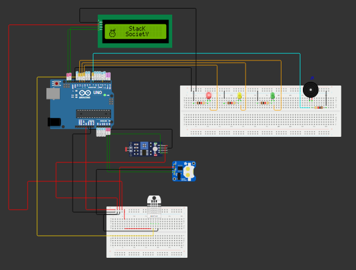

# Monitor de Temperatura, Umidade e Luminosidade com Registro em EEPROM e Alertas em Tempo Real

Este projeto utiliza um microcontrolador Arduino para monitorar temperatura, umidade e luminosidade em tempo real, registrando as leituras na memória EEPROM para análise histórica. Os dados são exibidos em um display LCD, e alertas visuais e sonoros são acionados através de LEDs e um buzzer quando os valores ultrapassam limites pré-definidos. A utilização da EEPROM garante que as informações sejam preservadas mesmo após desligamentos, permitindo o acompanhamento contínuo das condições ambientais.

## Requisitos

Para compilar e executar este código, você precisará dos seguintes componentes:

- **Hardware:**
  - Arduino Uno ou equivalente: Microcontrolador que executa o código e controla todos os componentes.
  - Sensor DHT22 ou 11: Mede a temperatura e a umidade do ambiente.
  - Sensor LDR: Mede a luminosidade, permitindo o monitoramento das condições de luz.
  - Display LCD 16x2 com interface I2C: Exibe as leituras de temperatura, umidade e luminosidade, além de informações sobre alertas.
  - Buzzer: Emite sinais sonoros para alertar quando os valores ultrapassam limites pré-definidos.
  - LEDs (vermelho, amarelo, verde): Indicadores visuais que mostram o status das medições (ex: níveis normais ou de alerta).
  - Resistores 1kΩ (para LEDs e LDR): Limitam a corrente que passa pelos LEDs e ajudam a calibrar o sensor LDR.
  - Fios de conexão: Usados para conectar todos os componentes eletrônicos entre si.
  - RTC DS1307 I2C: Mantém a contagem da data e hora, permitindo que as leituras sejam registradas com informações temporais.

- **Software:**
  - Arduino IDE
  - Bibliotecas necessárias:
    - `DHT`
    - `Wire`
    - `LiquidCrystal_I2C`
    - `EEPROM`
    - `RTClib`

## Instalação

1. **Instalar as Bibliotecas:**
   - Abra o Arduino IDE.
   - Vá para `Sketch` > `Incluir Biblioteca` > `Gerenciar Bibliotecas...`.
   - Pesquise e instale as bibliotecas mencionadas acima.

2. **Conectar os Componentes:**
   - Conecte o sensor DHT ao pino 3
   - Conecte o LDR ao pino A0.
   - Conecte os LEDs aos pinos 10 (vermelho), 11 (amarelo) e 12 (verde).
   - Conecte o buzzer ao pino 7.
   - Conecte o display LCD ao barramento I2C.
   - Conecte o RTC DS1307 ao barramento I2C, garantindo que os pinos SDA e SCL estejam corretamente conectados aos pinos correspondentes no Arduino.

3. **Carregar o Código:**
   - Copie e cole o código fornecido no Arduino IDE.
   - Compile e faça o upload para o seu Arduino.

## Uso

Após carregar o código no Arduino, o dispositivo começará a monitorar a temperatura, umidade e luminosidade. Os dados serão exibidos no display LCD e os LEDs mudarão de estado dependendo das leituras:

- **LED Vermelho:** Acende quando a temperatura, umidade ou luminosidade ultrapassam os limites máximos.
- **LED Amarelo:** Acende quando a temperatura, umidade ou luminosidade ultrapassam os limites de alerta.
- **LED Verde:** Acende quando todos os valores estão dentro dos limites normais.

O buzzer emitirá um sinal sonoro correspondente aos alertas.

## Estrutura do Código

O código é dividido em várias seções principais:

1. **Definições e Inicializações:**
   - Define pinos e configurações iniciais para os sensores e dispositivos.
   - Cria instâncias dos objetos necessários, como `DHT`, `LiquidCrystal_I2C` e `RTC_DS1307`.

2. **Funções de Carregamento de Ícones:**
   - Funções para criar ícones personalizados para umidade, temperatura e luminosidade no display LCD.

3. **Funções de Configuração (`setup`):**
   - Inicializa os sensores, comunicação serial, display LCD e RTC.

4. **Loop Principal (`loop`):**
   - Lê dados dos sensores, verifica limites e atualiza LEDs e buzzer conforme necessário.
   - Exibe os dados no LCD e registra a data e hora em EEPROM.

5. **Funções de Status:**
   - Funções para determinar e retornar o status da umidade, temperatura e luminosidade.

## Armazenamento em EEPROM

O projeto utiliza a memória EEPROM do Arduino para registrar a data e a hora das leituras de temperatura, umidade e luminosidade. Isso permite que os dados sejam retidos mesmo quando o Arduino é desligado. Os dados podem ser acessados para análise posterior, possibilitando o monitoramento histórico das condições ambientais.

## Link do simulador

Link do simulador do projeto: https://wokwi.com/projects/413043800017889281

## Autores

Stack Society

- Vitor de Lima Domingues.
- Giovanni Romano Provazi.
- João Pedro Vieira de Morais.
- Enzo Galhardo.